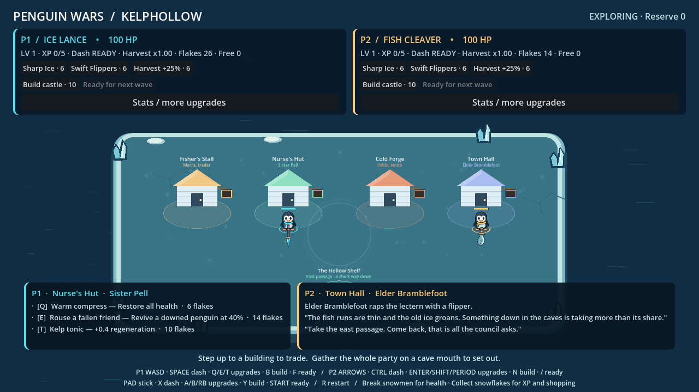
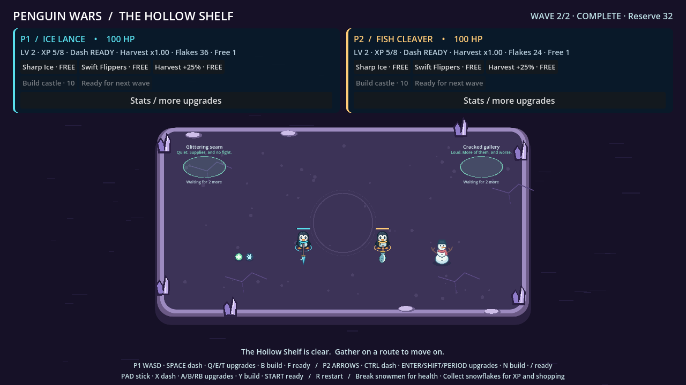
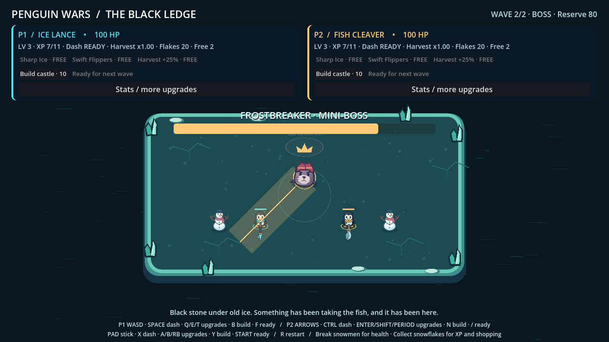

# Penguin Wars

A Godot 4.7 foundation for a 1–4 player, top-down co-op action roguelite. Open `project.godot` and press **F5** to run the project. No plugins, external assets, or dependencies are required.

There are two runnable scenes. `scenes/arena/test_arena.tscn` is the single-arena combat slice and the project's main scene. `scenes/run/expedition.tscn` is the town-and-caves loop described under [Town and caves](#town-and-caves); press **F6** on it, or run `godot --path . scenes/run/expedition.tscn`. Both share the same party, combat, economy and defence systems.

## Play the test arena

- Player 1: **WASD**, **Space** dash, **Q / E / T** damage/speed/Harvest upgrades, **B** build castle, **F** ready for next wave.
- Player 2: **Arrow keys**, **Ctrl** dash, **Enter / Shift / Period** upgrades, **N** build castle, **Slash (/)** ready.
- Each assigned gamepad: **left stick**, **X** dash, **A / B / right bumper** upgrades, **Y** build castle, **Start** ready.
- Attacks automatically strike the nearest enemy within weapon range.
- **R** restarts the run, including after victory or a party wipe.
- Upgrade, build and ready buttons also support mouse. Upgrades are chosen in the between-wave shop; all living players must ready up before the next wave.

### Supplies, snowflakes and defenses

Two breakable snowmen supply the arena. Weapons prioritize enemies, then target snowmen in range; cleaver sweeps can hit both. Each snowman drops a **25 HP** pickup and **3 snowflakes**. Full-health players leave healing on the ground. Missing snowmen return at the next wave; intact ones remain.

Enemy defeats drop **2 snowflakes** rather than immediately granting XP. Either player can collect a drop; its units are split round-robin among living players into **personal wallets**, also awarding XP. Uncollected snowflakes enter the run's reserve after a wave and add matching bonus value to future pickups. Downed players receive no allocation. Wallets and reserves reset with the run.

**Harvest** starts at x1.00 and upgrades by +0.25. It multiplies that player's income and corresponding XP, including the **5 base income** paid after each completed wave. Fractional earnings are retained so small drops still benefit. This multiplier is our chosen variation, not an exact copy of Brotato's flat harvesting stat.

XP still grants free stat choices. Extra upgrades cost **6 snowflakes**, increasing by **3 per personal paid purchase**. Shopping happens between waves; a purchase clears that player's ready status. The character sheet now offers 15 upgrades, including armor, regeneration, typed damage, critical hits, dodge, Engineering and Harvest. The original three remain quick shortcuts. Randomized items, rerolls, weapon merging and a full skill system are future work.

### Android and character stats

Use **Stats / more upgrades** on desktop to open the character sheet. Preview the phone layout with `godot --path . -- --mobile` or enable `TestArena.mobile_preview` in the inspector. Android automatically selects one local penguin, touch movement/dash, and large build/shop/ready buttons. The solo mobile character sheet pauses combat. Desktop co-op remains available; online co-op is future work.

The Android debug APK now builds and passes signing/alignment checks. Find it locally at `builds/penguin-wars-debug.apk`. **Physical phone testing remains pending.** Rebuild on this PC with `./tools/build-android.ps1 -WorkspaceToolchain`. See [mobile-and-stats.md](docs/mobile-and-stats.md) for stat formulas, extension points, preview controls and export setup.

**Snow castles are player-built defenses.** Spend **10 personal snowflakes** to place one on open ice in front of your penguin. Each player can build one per run. It fires friendly snowballs for **8 damage every 0.9 seconds**, with **275-pixel targeting range**, and never damages teammates. Invalid placements spend nothing. Castles persist between waves and reset with the run; they are currently indestructible support structures, with enemies continuing to target penguins.

The town, nurse, blacksmith, town hall and branching caves are now built; see [Town and caves](#town-and-caves) below and [hub-and-dungeons.md](docs/hub-and-dungeons.md) for what the direction still leaves open. In the arena slice a castle lasts the run; in a cave it belongs to the room it was built in.

### Combat slice

P1 (and P3) carries the **Ice Lance**: a fast single-target strike with 240-pixel range, 14 damage and a 0.42-second cooldown. P2 (and P4) carries the **Fish Cleaver**: a 140-degree sweep that damages every enemy in its 105-pixel reach for 22 damage, with a 1.05-second cooldown and stronger knockback. Both aim automatically at the nearest enemy. These are initial tuning values, not final balance.

Dashes travel at 680 pixels/second for 0.16 seconds and grant invulnerability during that burst. The 1.1-second cooldown starts when the dash begins. Move to set direction, or dash along the last movement direction when stationary. Holding the button does not repeat dashes. The HUD shows each player's weapon and dash readiness. Hit flashes, floating damage, expanding impact rings, dash trails and cleaver arcs make combat events visible. No global hit pause or camera shake disrupts the other player's view.

### Enemy roles

- **Seal raider:** the original pursuing contact enemy.
- **Charging seal:** orange armored brow, 44 HP. Marks an orange lane for 0.75 seconds, rushes straight along that lane, then recovers for 1.1 seconds with contact damage disabled. Step sideways or dash across the lane, then punish its recovery. Introduced as the third spawn in wave 1.
- **Snowball thrower:** blue winter cap and visible snowball, 28 HP. Maintains distance, marks its locked aim with a dotted line for 0.7 seconds, then fires a non-homing snowball. Snowballs deal 10 damage, hit at most one player, and expire after three seconds. Close the gap to force it to retreat. Introduced in wave 2.
- **Boss:** a crowned, oversized seal at the end of a room that carries one. See [Town and caves](#town-and-caves).

Contact reach, target size, projectile damage and knockback resistance are per-enemy exported values rather than shared constants, which is what lets a boss be a larger, steadier target without a second combat path.

The cleaver's strong knockback interrupts charger windups/rushes and thrower windups. The lance still pushes enemies but does not interrupt these attacks. Dash immunity blocks a snowball and consumes that shot. Enemy counts and the existing dash/weapon tuning are unchanged; mixed roles make positioning more important. These are initial encounter balance values for playtesting.

Three seeded encounters scale enemy count with party size. Collected materials and end-of-wave income grant XP; each player chooses upgrades independently. Downed players stop moving/attacking and are excluded from enemy targeting. Revival exists only as the nurse's service in town, through `Health.revive()`; nothing revives a penguin mid-fight. The arena uses original illustrated SVG penguins, seal raiders and visible held weapons, with a procedural ice-island backdrop.

Set `TestArena.player_count` in the inspector to 1–4. Slots 1 and 2 have keyboard controls; slots 3 and 4 require gamepads. Slot indices map directly to Godot device IDs 0–3; a lobby/device assignment screen is a future extension. Keyboard and gamepad can control the same assigned slot. Physical keyboard bindings are intentionally fixed for this test scene.

## Town and caves



The party starts in **Kelphollow**. Services are entered by standing at them, so the town adds no bindings to learn: the same keys that pick wave-shop upgrades pick that service's three offers (P1 **Q/E/T**, P2 **Enter/Shift/Period**, gamepad **A/B/RB**). Step away and the panel closes.

| Building | Keeper | Offers · cost in snowflakes |
| --- | --- | --- |
| Fisher's Stall | Marra | Herring ration, 40 health · **4** — Packed snow, +12 maximum health · **8** — Traveller's charm, +0.25 Harvest · **11** |
| Nurse's Hut | Sister Pell | Warm compress, full health · **6** — Rouse a fallen friend, revive at 40% · **14** — Kelp tonic, +0.4 regeneration · **10** |
| Cold Forge | Odda | Hone the edge, +4 weapon damage · **9** — Rebalance the haft, +10% attack speed · **9** — Trade weapon, lance for cleaver and back · **6** |
| Town Hall | Elder Bramblefoot | No purchases. A short meeting that reads the run journal and changes once the party has been down a cave. |

Rousing a downed penguin is the first revival in the game. `Health.revive()` is deliberately a separate operation from healing, which still cannot raise the dead; the player restores the collision layers it recorded when it entered the tree. A downed penguin cannot buy its own revival — someone still standing has to pay for it.

### The Hollow Shelf



The first cave is four rooms: an entrance fight, then a choice between the quiet **Glitter Seam** — four snowmen and no enemies — and the louder **Cracked Gallery**, with more enemies, faster spawns and a **1.25 difficulty multiplier** that raises every spawned enemy's health and damage. Both meet at the **Black Ledge**, and the ledge leads home. Each room owns its own bounds, spawn ring, supply points and palette.



The Black Ledge ends in a **boss**. When the last wave of a room with a boss is cleared, the boss enters alone from the corner furthest from the living party, and the way home stays shut until it is down. **Frostbreaker**, the rank-one mini-boss, has 500 health scaled by **+65% per extra penguin** — 825 for a pair — and pays **15 snowflakes to every living penguin**, through each one's own Harvest.

Bosses telegraph like the charger and thrower do: the charge lane, the radial volley and the slam are all drawn during a windup that lands no damage, and contact only hurts during the rush itself. Unlike ordinary enemies a boss does **not** drop its windup when hit, and its `knockback_multiplier` of 0.08 means heavy weapons cannot shove it around — a cleaver cannot stun-lock the fight. Rank two adds the volley, rank three adds the slam and enrages below half health. `resources/bosses/` holds all three; only the mini-boss is placed so far.

Routes stay shut until the room is cleared, then open only while **every living penguin stands on the pad together** for one second. Stepping off cancels it. Branching therefore needs no new input binding, and one player cannot drag the party through a door.

What crosses a room boundary: wallets, stats, levels, purchase counts, carried weapons and current health. What does not: enemies, projectiles, uncollected snowflakes, snowmen and built castles. A castle belongs to the room it was built in, and its owner may build another in the next room — room persistence for defences remains an open decision.

Returning to town records the cave in the run journal and the elder's meeting changes. The journal is run-scoped: **R** restarts the run and the town forgets. Save data, persistent unlocks, and the split between permanent and temporary blacksmith power are still open design questions. Service panels are keyboard and gamepad only; the Android touch layout covers the arena slice, not the town.

These are first values for playtesting, not final balance.

## Structure

| Location | Responsibility |
| --- | --- |
| `scenes/actors` | Reusable player and enemy scenes |
| `scripts/actors` | Character motion and enemy behavior |
| `scripts/party` | Stable player identity and party queries |
| `scripts/input` | Local movement input adapter |
| `scripts/combat` | Health, damage messages, weapon runtime |
| `scripts/progression` | Per-player XP and run reward/choice policy |
| `scripts/loot`, `scenes/props` | Breakable snowmen, health/material pickups and wave resupply |
| `scripts/defenses` | Player-funded castle placement and friendly projectiles |
| `scripts/data`, `resources` | Typed weapon, upgrade and encounter definitions |
| `scripts/encounters` | Seeded spawn and encounter state machine |
| `scripts/enemies` | Replaceable charge/ranged behaviors and enemy snowballs |
| `scripts/bosses`, `resources/bosses` | Boss actor, telegraphed behavior and boss data |
| `scripts/rooms`, `resources/rooms` | Room-owned bounds and prop placement; shared party gates |
| `scripts/run`, `scenes/run`, `resources/caves` | Run session, run journal and the town-and-caves root |
| `scripts/town` | Town buildings, service prices and effects |
| `scripts/camera`, `scripts/ui` | Shared view and test HUD |
| `scripts/arena` | Small composition root |
| `scripts/visuals`, `assets` | Character animation, held weapons, illustrated SVGs and ice arena art |
| `tests` | Engine integration and renderer smoke tests |

## Extension points and boundaries

**Party and networking.** `PlayerIdentity.player_id` is a unique run slot (1–4). `owner_peer_id` is a separate future connection mapping; multiple local slots may share the same peer. `PartyRoster` is session-owned and rejects duplicate IDs. There are no global singleton player references. This is playable local co-op, **not online multiplayer**: there are no RPCs, authority enforcement, replicated spawns, prediction, reconnect, or serialization yet. Before online play, introduce a host-owned simulation, validated input commands, stable enemy IDs and authoritative rewards; route all actor spawning, damage and upgrade choices through it. The seed makes spawn selection repeatable for the same simulation state, not lockstep deterministic.

**Input.** The player consumes `LocalPlayerInput.movement()`. Replace that adapter with remappable actions, recorded commands, or network commands. Move ownership checks to the future session layer. Gamepads have a radial dead zone. Hot-plug lobby assignment and physical controller testing remain future work.

**Damage.** `Health.take_damage(DamageEvent)` is the shared damage interface; `changed`, `damaged` and `died` are the output hooks. Damage events retain the source party ID and a knockback impulse. Dead actors reject further damage and healing; use a separate explicit revive operation later. `HitFeedback` listens to accepted damage and creates short-lived world effects which survive enemy deletion. `DashController` owns per-player burst/cooldown state; the player applies its motion and invulnerability. Weapons currently use instantaneous single-target or arc attacks. Add projectile scenes, teams and status effects around these interfaces. Before adding other immunity sources, replace the single invulnerability flag with a composed immunity policy.

**Data.** Add `.tres` resources using `WeaponDefinition`, `UpgradeDefinition`, or `EncounterDefinition`. Shared resources are definitions and must remain immutable during play. Runtime cooldowns and damage bonuses belong to each weapon instance. `PenguinPlayer.apply_upgrade()` is the initial stat application seam; move into a dedicated stat aggregator when stacking rules grow. `RunProgression.OPTIONS` is the test catalog, ready to replace with weighted offers and unlock filters.

**Visuals.** `CharacterVisual` creates character sprites, team scarves and cosmetic movement bobbing. `WeaponVisual` reads the weapon's presentation aim/attack phase to place its art beside the player and animate a thrust or sweep. Each weapon Resource supplies `held_texture` and `visual_scale`; add right-facing art with its handle on the left. Damage timing remains in `WeaponController`, independent of sprite motion. Idle weapons face the player's last movement direction; in-range targets drive aim between attacks. Attack tracers retain their actual impact position. `IceArenaVisual` owns purely decorative seeded ice, crystals and snow; these props do not block movement. The camera reserves top/bottom HUD space and expands that allowance for a four-player party. All assets in `assets/` were authored for this project; no Brotato assets were imported.

**Encounters.** `EncounterDirector` emits state changes, kill events and completion. Spawn placement currently assumes this centered bounded arena and chooses the safest perimeter candidate. Replace this method with region spawn markers/navigation for real maps. Enemy movement is direct pursuit with world collision support, not pathfinding. Actors do not block one another. External despawns need an explicit director cancellation/despawn path so enemy counts remain correct.

**Enemy behavior.** `ArenaEnemy` remains the shared health, contact and knockback actor, and now exports `contact_radius`, `hit_radius`, `projectile_damage` and `knockback_multiplier` so size, reach and steadiness are per-enemy data. `ArenaBoss` is an ordinary enemy with those values turned up and a `BossBehavior`; it dies, drops and pays through the same interfaces, so nothing else in combat knows a boss is special. `EncounterDefinition.difficulty_multiplier` scales spawned enemy health and damage, which is how one room is harder than another without a second set of enemy scenes. Boss placement and the boss phase live in `EncounterDirector`; a room without `EncounterDefinition.boss` still completes when its waves do. Optional `EnemyBehavior` children supply movement and attack state; inherited charger/thrower scenes configure those strategies. `EnemyAttackVisual` reads state to display warnings without controlling damage. New encounter Resource fields select the charger and ranged scenes; the director owns their introduction cadence. `EnemySnowball` uses swept segment hits against living party members and a layer-1 world ray, with no friendly fire. Shots can outlive their shooter but are cleared at wave completion or party wipe and freed with the run; projectiles expire on a lifetime rather than on bounds, so they need no room data of their own.

**Rooms.** `RoomDefinition` owns bounds, the spawn ring, supply points, the entry point, a backdrop palette, an encounter and its exits. `RoomExit` names its target by id rather than holding a reference, so room resources never form a cycle and `CaveDefinition` is the only place a route graph lives; `CaveDefinition.unresolved_exits()` turns a broken route into a test failure instead of a dead session. `RoomSpace.apply()` hands that space to the party, director, builder, loot, camera and backdrop — systems receive their space from the composition root and none reaches for a global current room. Room bounds are still a rectangle with no interior world collision; navigation, doors and irregular rooms need real geometry.

**Runs and places.** `RunSession` holds the wiring both runnable scenes use, so the arena slice and the expedition cannot drift apart. `Expedition` is the run root: wallets, stats, levels and purchases live there and survive a room change, while the room's own actors are removed with it. `PartyGate` is the shared travel rule — cleared, whole party, one second — used by cave routes and town cave mouths alike. `TownService` zones are positional and `TownMarket` owns prices and effects; it reaches players only through the wallet and their own health, stat and weapon interfaces, which is where a later item or skill layer hooks in. `TownHub.SERVICES` is a layout table because one town exists; a second town moves it into room data. `RunJournal` records what the town knows and resets with the run.

**Exploration and camera.** The camera frames the current room and living party, with margin and smoothing; `framed_size` follows the room and `bottom_reserve` lets a scene keep space for panels drawn over the world. Players are clamped to the room's bounds. Party tethering is currently absolute — the gate rule keeps the party together at transitions, and nothing prevents separation inside a room. No split-screen is implemented.

**Progression.** `Experience` handles XP overflow and emits one event per level; `RunProgression` owns team reward policy and queued personal choices. Downed players receive no XP. A new arena instance starts a fresh run. Save data, unlocks, inventory, bosses, interaction and run route selection are deliberately left to subsequent layers.

**Economy and skills seam.** `PlayerStats` is a unique Resource instance per player and owns the Harvest multiplier/fractional carry. `RunWallet` owns balances; `RunProgression` owns material allocation, wave payments, purchases and readiness. `ArenaLoot` owns supply placement, drop wiring and reserve banking. `RunPickup` prevents duplicate collection and wasted healing. Breakable weapon targets expose a `Health` child and join `breakables`; enemy targets remain higher priority. `CastleBuilder` validates ownership, placement and affordability before spending. A future skill layer can grant stat modifiers or abilities through these separate systems. Move arena-specific bounds and prop locations into room data before introducing dungeons.

## Verification

From this directory, with `godot` available:

```powershell
godot --headless --path . --editor --import --quit
godot --headless --path . --script res://tests/foundation_test.gd
godot --headless --path . --script res://tests/combat_feel_test.gd
godot --headless --path . --script res://tests/enemy_behavior_test.gd
godot --headless --path . --script res://tests/economy_test.gd
godot --headless --path . --script res://tests/stats_mobile_test.gd
godot --path . --script res://tests/render_smoke.gd
godot --path . --script res://tests/enemy_render_smoke.gd
godot --path . --script res://tests/economy_render_smoke.gd
godot --path . --script res://tests/mobile_render_smoke.gd
godot --path . --script res://tests/mobile_render_smoke.gd -- --wide
godot --headless --path . --script res://tests/town_cave_test.gd
godot --headless --path . --script res://tests/boss_test.gd
godot --path . --script res://tests/town_render_smoke.gd
godot --path . --script res://tests/boss_render_smoke.gd
```

The integration test fails with a nonzero exit code on failed assertions. It covers party IDs/capacity, movement/bounds, death/retargeting, XP overflow, queued upgrades and resource isolation, actual weapon kills/rewards, encounter completion, party wipe and scene cleanup. The renderer test writes `docs/arena-preview.png` using the live viewport. See `docs/verification.md` for actual results and limitations.

The combat test checks dash speed, immunity windows, cooldown, death gating and player isolation; cleaver multi-target coverage, rear/range exclusions and knockback; weapon cooldown and long-range single-target lance behavior. The renderer test includes a controlled combat pose to inspect effects reliably. Physical input and subjective combat feel still need human playtesting.

The town and cave test walks the whole loop against the real expedition scene: cave route integrity, service purchases and every refusal path, revival and the collision layers it restores, the locked-route rule, per-room bounds and spawn rings, supply rooms stocking without a wave, castles being refused in town but built in a fight, a free choice earned underground being spendable at home, and exactly what does and does not survive a room change. `town_render_smoke.gd` writes `town-preview.png`, `cave-entrance.png`, `cave-branch.png` and `cave-supply-room.png` from the live viewport.

The boss test walks the cave to the Black Ledge and checks that the boss follows the final wave rather than replacing it, that health scales with party size, that routes stay shut while it lives, that each telegraph is harmless and direction-locked, that a heavy hit cannot cancel a windup, and that the reward is paid once to every living penguin and cannot be claimed twice. `boss_render_smoke.gd` writes `cave-boss.png`.
